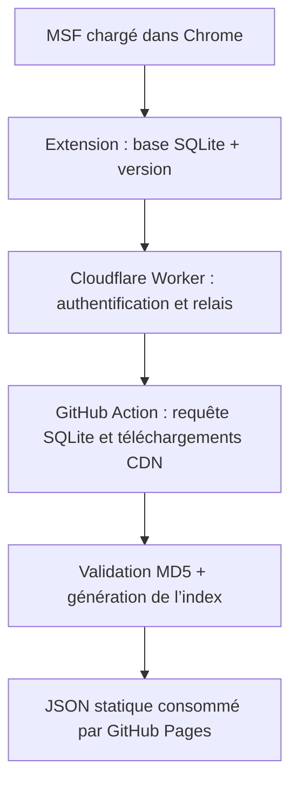

# Carnet de bord — pipeline des capacités MSF

> Source de vérité technique du projet LoSP pour localiser, récupérer, valider et transformer les données officielles qui décrivent les capacités de Marvel Strike Force.

**État au 29 juillet 2026 :** la source déclarative, la collecte locale et la récupération GitHub des 11 fichiers sont validées. La vraie base de 16 384 octets en quatre morceaux a permis de publier les 11 JSON et leur manifeste sur `main`. Le Worker Cloudflare dédié est déployé depuis `main`, puis la chaîne `/update` → GitHub a été validée jusqu’à la fin de l’Action. L’extension Chrome 0.2.0 est raccordée à ce Worker avec un envoi en un clic et une mémorisation locale facultative du mot de passe. Le parseur structurel v1, le normaliseur v1 et l’indexeur v1 de `characters.json` et `procs.json` sont validés. Le publisher Web v1 copie désormais les huit artefacts indexés sous un chemin immuable de `/docs` ; aucun chargeur JavaScript, changement PWA ou module d’interface n’a commencé.

## 1. Objectif et périmètre

Le but est de permettre à la webapp statique LoSP de répondre correctement à des questions comme :

- quels personnages appliquent un Blocage de capacité, Trauma, Étourdissement, Perturbation, Exposé, etc. ;
- avec quelle capacité : basique, spéciale, ultime, passif, assist/counter ou variante renforcée ;
- à quelle cible, avec quelle probabilité et pour combien de tours ;
- sous quelles conditions : mode de jeu, attaque/défense, trait ou allié requis, Chargé, seuil de vie, critique, déclencheur passif, etc. ;
- si l’effet est appliqué, retiré, transféré, inversé ou prolongé.

Ce projet est un **indexeur de capacités**, pas un simulateur de combat. Nous voulons exploiter la logique déclarative officielle, sans reproduire à l’identique le moteur de combat Unity et tous ses cas limites.

## 2. Conclusion technique validée

La logique utile n’est pas limitée aux descriptions textuelles de l’API publique. Elle se trouve principalement dans des fichiers JSON officiels de `combat_data`, dont les noms sont versionnés par un hash MD5.

Le client web conserve le catalogue actif dans une petite base SQLite locale :

```text
IndexedDB /idbfs
└── object store FILE_DATA
    └── …/Config/combat_data.db/
        ├── 0
        ├── 1
        ├── 2
        └── file_size
```

La base reconstruite contient la table `RemoteAssetClientEntry`, qui associe chaque ressource à son hash actif. La version du client est disponible séparément dans `buildUrl`. Ces deux éléments permettent de construire l’URL CDN candidate d’un fichier publié avec cette version. Un fichier inchangé n’est cependant pas toujours recopié dans le dossier de la version courante ; le pipeline conserve donc les sources validées et les réutilise uniquement lorsque leur MD5 correspond toujours au catalogue actif.

Il n’y a donc :

- ni déchiffrement à effectuer ;
- ni trafic réseau du jeu à intercepter à chaque mise à jour ;
- ni hash à deviner ;
- ni besoin de conserver une session MSF ou un jeton GitHub dans les fichiers du dépôt.

Un clic dans une extension Chrome, après le chargement du jeu, pourra fournir à GitHub les informations nécessaires à toute la suite du pipeline.

## 3. Origines, adresses et sources connues

### 3.1 Jeu web

| Usage | Adresse ou origine |
|---|---|
| Page publique | `https://marvelstrikeforce.com/` |
| Frame Unity du jeu | `https://webplayable.m3.scopelypv.com/` |
| API interne du jeu | `https://msf-api.m3.scopelypv.com/` |
| CDN des règles volumineuses | `https://cdn.m3.scopelypv.com/bulky_rules/` |

L’API interne `msf-api.m3.scopelypv.com` transporte des requêtes propres à la session du joueur. Elle n’est pas nécessaire à ce projet et ne doit pas être capturée ou transmise par l’extension.

### 3.2 API publique officielle

Base :

```text
https://api-prod.marvelstrikeforce.com/services/api/
```

Endpoints déjà identifiés comme complémentaires :

- `getCharacterList`
- `getCharacterAbilities`
- `getCharacterAbilityCaps`
- `getCharacterInstanceCaps`
- `getCharacterMaxStatCaps`
- `getTraits`
- `getTraitsByCategory`
- `getIso8Abilities`
- `getGear`
- `getUpgradeTokens`

Exemples déjà utilisés dans le dépôt :

```text
https://api-prod.marvelstrikeforce.com/services/api/getCharacterList?lang=fr
https://api-prod.marvelstrikeforce.com/services/api/getLocalization?tableId=heroes&lang=fr&format=json
```

L’API publique reste utile pour les noms, portraits, descriptions, icônes et plafonds de niveaux. Elle n’est pas la source de vérité suffisante pour toutes les conditions exécutables des capacités.

### 3.3 Images officielles

Base observée :

```text
https://assets.marvelstrikeforce.com/imgs/
```

Exemples :

```text
https://assets.marvelstrikeforce.com/imgs/Portrait_Abomination_d466494d.png
https://assets.marvelstrikeforce.com/imgs/ICON_ABILITY_SPIDERMAN_BASIC_74d32f44.png
```

Le suffixe fait partie du nom versionné. Il ne faut pas tenter de construire une URL d’image à partir du seul identifiant interne si l’API fournit déjà l’URL exacte.

### 3.4 Ressources Unity secondaires

Le client charge aussi un catalogue Addressables, par exemple lors de l’observation du 21 juillet 2026 :

```text
https://cdn.m3.scopelypv.com/odr/324fb7f0-1f87-4f27-8e14-ce38588aa767/catalog_remote.hash
https://cdn.m3.scopelypv.com/odr/324fb7f0-1f87-4f27-8e14-ce38588aa767/catalog_remote.bin
```

Ce catalogue ne contenait pas la référence `bulky_rules/combat_data/characters`. Il ne remplace donc pas `combat_data.db` pour découvrir les hashes.

Les fichiers Unity/IL2CPP déjà étudiés (`.wasm.gz`, `.data.gz`, `dump.cs`, `script.json`, `stringliteral.json`) sont des sources de secours pour comprendre l’exécution d’une primitive ambiguë. Ils ne sont pas nécessaires au premier indexeur d’effets.

## 4. Localisation dans le stockage du navigateur

### 4.1 Contexte indispensable

Dans les DevTools, la console doit être placée dans le contexte :

```text
webplayable.m3.scopelypv.com
```

Le contexte `top` ne voit pas le même stockage. Une erreur indiquant que `FILE_DATA` est absent peut donc simplement signifier que le script a été exécuté dans le mauvais frame.

### 4.2 Bases IndexedDB observées

| Base | Object store | Utilité actuelle |
|---|---|---|
| `/idbfs` | `FILE_DATA` | Contient les morceaux de `/Config/combat_data.db` ; source retenue |
| `UnityStorage` | `files` | Présent, mais inutile pour le pipeline actuellement validé |

### 4.3 Clés à rechercher

Le chemin utile est `Config`, pas `AssetDBs` :

```text
…/Config/combat_data.db/0
…/Config/combat_data.db/1
…/Config/combat_data.db/2
…/Config/combat_data.db/file_size
```

La partie située avant `/Config/` peut varier ou ne pas être évidente dans l’affichage. Il faut rechercher les morceaux avec une expression suffixe et conserver la clé IndexedDB originale pour la lecture :

```js
const CHUNK_PATTERN = /\/Config\/combat_data\.db\/(\d+)$/i;
```

Règles de reconstruction :

1. ouvrir une base existante avec la version renvoyée par `indexedDB.databases()` ;
2. annuler `onupgradeneeded` afin de ne jamais créer ou modifier une base par erreur ;
3. ouvrir une transaction `readonly` sur `FILE_DATA` ;
4. récupérer toutes les clés ;
5. retenir uniquement les clés finissant par `/Config/combat_data.db/<nombre>` ;
6. trier les morceaux par index numérique ;
7. convertir chaque valeur en octets, y compris si elle est encapsulée dans `contents` ou `data` ;
8. concaténer les morceaux en mémoire ;
9. vérifier l’en-tête ASCII `SQLite format 3` ;
10. ignorer `file_size` lors de la concaténation, mais éventuellement l’utiliser comme contrôle supplémentaire.

La base observée faisait `16 384` octets et comportait trois morceaux. Ces valeurs sont un constat, **pas des constantes à coder**.

## 5. Structure SQLite validée

Schéma exact observé :

```sql
CREATE TABLE "RemoteAssetClientEntry" (
  "id" varchar primary key not null,
  "path" varchar,
  "type" integer,
  "hash" varchar,
  "status" varchar,
  "url" varchar
);

CREATE UNIQUE INDEX "idx_id"
ON "RemoteAssetClientEntry"("id");
```

Requête minimale pour `characters.json` :

```sql
SELECT id, hash, status, url
FROM RemoteAssetClientEntry
WHERE id = 'combat_data/characters.json';
```

Requête retenue pour le pipeline complet :

```sql
SELECT id, hash, status, url
FROM RemoteAssetClientEntry
WHERE id LIKE 'combat_data/%.json'
ORDER BY id;
```

Constats importants :

- les 11 entrées actives avaient `status = 'local'` ;
- la colonne `url` existait, mais valait `NULL` pour les 11 entrées ;
- `path` est une chaîne Base64URL opaque qui contient notamment le nom et l’extension, mais ni `10_3_0` ni l’URL CDN complète ;
- les pages brutes SQLite peuvent garder des traces d’anciens enregistrements supprimés.

Il faut donc exécuter une vraie requête SQLite. Une simple recherche de chaînes dans les octets pourrait récupérer un ancien hash.

## 6. Catalogue observé le 21 juillet 2026

Version du client : `10_3_0`  
Build observé : `1654625`

| Ressource | Hash actif dans SQLite | Taille logique observée | Rôle dans le projet |
|---|---|---:|---|
| `ai_filter.json` | `dc3e6c1cbd5507e48f8b48492bb13d94` | 18 entrées | Filtres génériques utilisés par l’IA |
| `ai_selector.json` | `c535c94667f22ec008909e47386c02f2` | 77 entrées | Pondération et sélection des cibles par l’IA |
| `battlefield_effects.json` | `2ab3984b81c2598bafe624d5c6b13631` | 13 entrées | Effets de champ de bataille et leurs actions/passifs |
| `characters.json` | `028d99dcb9da89896a3a49b4385474de` | 499 personnages | Source principale : actions, effets, conditions, cibles, niveaux, traits et modes |
| `combat_mods.json` | `bc14932baa42717af78859600ae4f9b8` | `mods` vide, 64 octets | Modificateurs injectés par modes, salles, saisons et événements |
| `constants.json` | `4442126880a5aa8699bccd638a55e7ee` | 3 entrées | Constantes de combat complémentaires |
| `iso8skills.json` | `aaba1a3625807ef69b50b3dd858fd742` | 5 entrées | Logique des classes et capacités ISO-8 |
| `missiontraits.json` | `bd944227ffe5a9fccbfccd52a6892cb8` | 21 groupes | Groupes de personnages imposés par certaines missions |
| `overpower_bonuses.json` | `8e3f9b475acb12678659de1ed42f322d` | 2 entrées | Bonus liés au système Overpower |
| `places.json` | `671e28ea2754ccd2e4ec6db12b893880` | 10 entrées | Définitions liées aux positions/cibles |
| `procs.json` | `b25580b243758b80a2aafae42f20d41b` | 286 effets | Dictionnaire des buffs, debuffs, états et effets techniques |

### Priorités fonctionnelles

- **Minimum indispensable au filtre de capacités :** `characters.json` et `procs.json`.
- **Contexte de combat à collecter dès la première version :** `combat_mods.json`, `battlefield_effects.json`, `iso8skills.json` et `missiontraits.json`.
- **Compléments et évolutivité :** `ai_filter.json`, `ai_selector.json`, `constants.json`, `overpower_bonuses.json` et `places.json`.

Puisqu’il n’y a que 11 fichiers, le pipeline doit tous les récupérer et les archiver comme un ensemble cohérent, même si la première interface n’en exploite qu’une partie.

### Anomalie détectée puis résolue

Lors de la vérification locale, 10 fichiers extraits correspondaient exactement aux hashes du catalogue. La copie disponible de `combat_mods.json` avait le MD5 `8fb315c3bfdb8174532f9eb37d4f0d14`, alors que la base active annonçait `bc14932baa42717af78859600ae4f9b8`.

Cette copie était ancienne ou issue d’un autre instantané. Le fichier actif a ensuite été retrouvé et validé avec le MD5 attendu ; il contient actuellement `{"Data":{"mods":{}},"ForceImportVersion":2,"Name":"combat_mods"}`. Le pipeline refuse tout fichier dont le MD5 ne correspond pas au catalogue actif.

## 7. Construction des URL CDN

Formule observée :

```text
https://cdn.m3.scopelypv.com/bulky_rules/{catégorie}/{version}/{nom}.{hash}.{extension}
```

Pour une ligne ayant :

```text
id      = combat_data/characters.json
hash    = 028d99dcb9da89896a3a49b4385474de
version = 10_3_0
```

l’URL devient :

```text
https://cdn.m3.scopelypv.com/bulky_rules/combat_data/10_3_0/characters.028d99dcb9da89896a3a49b4385474de.json
```

Le hash du catalogue est le MD5 exact des octets téléchargés. Pour `characters.json`, l’`ETag` observé correspondait également à ce MD5, mais le pipeline calcule lui-même le hash du contenu au lieu de dépendre uniquement de l’en-tête HTTP.

### Nuance importante sur le dossier de version

L’URL ci-dessus fonctionne pour `characters.json`, publié dans `10_3_0`. Les tests ont cependant montré qu’un fichier inchangé peut ne pas être présent dans le dossier courant, tout en restant actif dans SQLite. Par exemple, le `combat_mods.json` actif était disponible sous `10_2_1`, mais pas sous `10_3_0`.

La stratégie retenue est donc :

1. si le fichier déjà versionné dans `data/msf-capabilities/raw/` possède le MD5 actif, le conserver sans nouvel appel réseau ;
2. sinon, tenter le dossier de la version courante ;
3. si le CDN répond explicitement que cette version ne contient pas le fichier, essayer une liste bornée de versions antérieures ;
4. dans tous les cas, accepter le fichier uniquement si son MD5, son JSON et sa structure concordent ;
5. enregistrer dans le manifeste la version et l’URL exactes ayant fourni le contenu, lorsqu’elles sont connues.

Le premier ensemble validé est fourni dans une archive d’amorçage temporaire. La première exécution réussie la remplace par les 11 JSON bruts et la supprime du dépôt.

### Extraction de la version

La page du jeu exposait :

```js
buildUrl = "/10_3_0/1654625/Build";
```

La première version à essayer dans l’URL CDN est `10_3_0`. Le numéro `1654625` est le numéro de build et ne figure pas dans l’URL `bulky_rules`.

Une extraction robuste doit :

1. tenter de lire `window.buildUrl` dans le frame du jeu ;
2. à défaut, rechercher le motif `/VERSION/BUILD/Build` dans le document ou le script de chargement ;
3. valider la version avec un format du type `10_3_0`, sans figer le nombre de composantes.

Exemple de motif :

```js
const match = buildUrl.match(/\/((?:\d+_)+\d+)\/\d+\/Build(?:\/|$)/);
```

### Pourquoi une GitHub Action seule ne peut pas découvrir le hash

- la version publique est détectable ;
- le fichier est public lorsque son hash est connu ;
- la liste du dossier/bucket CDN renvoie `AccessDenied` ;
- aucun alias stable testé (`characters.json`, `characters.hash`, `manifest.json`, etc.) n’a fourni le dernier hash ;
- le catalogue Unity Addressables public ne contenait pas cette référence.

Le petit pont local fourni par l’extension reste donc nécessaire. Il ne sert qu’à lire le catalogue déjà téléchargé par le jeu.

## 8. Ce que contiennent les données de capacités

### 8.1 `characters.json`

Structure générale :

```text
Data
└── <characterId>
    ├── basic
    ├── special
    ├── ultimate
    ├── passive[]
    ├── safety
    ├── *_empower
    ├── counter / counter_empower
    ├── traits[]
    ├── passive_stats[]
    ├── global_stats[]
    ├── dynamic_stats[]
    └── autres métadonnées de combat
```

Tous les personnages n’ont pas toutes les sections. Dans l’instantané étudié :

- `basic` : 499 ;
- `special` : 467 ;
- `ultimate` : 396 ;
- `passive` : 442 ;
- `safety` : 477.

La cartographie structurelle du parseur v1 confirme que `safety` est la
variante technique associée à `basic` pour les informations Assist/Counter :
les 477 personnages possédant `safety` possèdent aussi `basic`, et les six
`safety_empower` correspondent aux six `basic_empower`. Ces variantes restent
des conteneurs techniques distincts et ne sont pas des capacités joueur.

`counter` et `counter_empower` n’existent que pour Gamora. Son `counter` est
strictement identique à `safety`; `counter_empower` ne diffère de
`safety_empower` que par le `visualid` de sa première action. Le parser les
conserve néanmoins séparément afin de ne pas supprimer une route technique
explicite des données source.

Les capacités peuvent aussi contenir des `alternatives`, des variantes `*_empower` et des actions imbriquées. Le parcours doit donc être récursif et ne pas se limiter à `ability.actions` au premier niveau.

### 8.2 Actions qui concernent les effets

| `action` interne | Sens à indexer |
|---|---|
| `proc` | Applique ou accorde un effet |
| `proc_remove` | Retire un effet ; ne doit pas être présenté comme une application |
| `proc_transfer` | Transfère un effet |
| `proc_flip` | Inverse buff/debuff |
| `proc_duration` | Prolonge ou réduit une durée selon `delta` ; peut ajouter avec `add_if_not` |
| `set_battlefield_effect` | Pose un effet de champ de bataille via `effect_id` |
| `clear_battlefield_effect` | Retire un effet de champ de bataille |

Cas particulier : les `procs` placés dans `spawn.pool[]` peuvent être appliqués au personnage invoqué. Ils doivent être classés comme effets d’invocation, pas comme effets directement posés sur la cible principale.

Une occurrence de `AbilityBlock` ou `LockedDebuff` dans `only_if`, `filter`, `target`, `test_action`, `dynamic_stats` ou une immunité décrit généralement une condition. Elle ne prouve pas que la capacité applique l’effet.

### 8.3 Champs à conserver

Pour chaque opération indexée, conserver au minimum :

- `characterId` ;
- emplacement de capacité et variante ;
- `effectId` interne ;
- opération normalisée ;
- `action_pct` par niveau ;
- `use_count`, `apply_count`, `count`, `delta` et durée éventuelle ;
- cible complète : `relation`, `type`, `limit`, `filter`, `primary_selection`, etc. ;
- conditions : `only_if`, `only_if_any`, `only_if_target`, `apply_if`, `action_cond`, `exec_for`, traits, mode et côté ;
- déclencheur passif `exec` ;
- fichier source ;
- chemin JSON source, afin de pouvoir diagnostiquer un résultat sans relire tout le fichier.

Les tableaux de valeurs représentent les niveaux d’amélioration. Il faut conserver le tableau complet. Une valeur « niveau maximal » peut être dérivée pour l’interface, mais ne doit pas remplacer les données brutes.

### 8.4 Identifiants internes d’effets

Le texte affiché en jeu n’est pas toujours l’identifiant présent dans `procs.json` :

| Identifiant interne | Effet affiché ou sens fonctionnel |
|---|---|
| `AbilityBlock` | Blocage de capacité |
| `LockedDebuff` | Trauma |
| `LockedBuff` | Safeguard / Sauvegarde |
| `BuffBlock` | Disrupted / Perturbation |
| `DebuffBlock` | Immunity / Immunité |
| `AccuracyDown` | Blind / Aveuglement |
| `DoT` | Bleed / Saignement |
| `HoT` | Regeneration / Régénération |
| `HealBlock` | Blocage des soins |
| `Stun` | Étourdissement |
| `Exposed` | Exposé |

Conséquence importante : une recherche littérale de `Trauma` dans les fichiers ne trouvera rien. Le filtre devra utiliser un mapping versionné `libellé UI ↔ effectId interne`. Les traductions françaises exactes devront venir de la localisation officielle ou d’un mapping contrôlé, pas d’une traduction improvisée dans le parseur.

### 8.5 Modes internes déjà rencontrés

| Valeur interne | Mode fonctionnel |
|---|---|
| `AVA` | Guerre d’alliance |
| `RAID` | Raid |
| `GRAND_TOURNAMENT` | Épreuve cosmique |
| `BATTLEWORLD` | Battleworld |
| `BATTLEGROUNDS` | Arène |
| `INSANITY` | Dimension noire |
| `MISSION` | Mission |
| `CHALLENGE` | Défi |
| `HORSEMEN` | Événement de type Fléau/Cavalier |
| `TOWER_MODE` | Tour |
| `EVENT_CAMPAIGN` | Campagne événementielle |

Le côté peut être précisé séparément avec `combat_side = offense|defense`. Les conditions peuvent être imbriquées dans `and`, `or` ou `not` ; elles ne doivent pas être aplaties au prix d’une perte de sens.

## 9. Exemples de contrôle pour le futur parseur

Ces chemins ont été vérifiés dans l’instantané du 21 juillet 2026 et serviront de tests de non-régression :

| Résultat attendu | Chemin source |
|---|---|
| Adam Warlock applique `AbilityBlock` avec sa spéciale | `Data.AdamWarlock.special.actions[1]` |
| Ant-Man applique `AbilityBlock` avec sa spéciale | `Data.AntMan.special.actions[1]` |
| Apocalypse applique `LockedDebuff` (Trauma) avec son ultime | `Data.Apocalypse.ultimate.actions[4]` |
| Arès applique `LockedDebuff` uniquement en `AVA` avec sa spéciale | `Data.Ares.special.actions[4]` |
| Abomination applique `Stun` avec son ultime | `Data.Abomination.ultimate.actions[3]` |

Le parseur doit également réussir les tests négatifs suivants :

- un effet seulement mentionné dans `only_if` n’est pas classé comme appliqué ;
- `proc_remove` n’est pas classé comme application ;
- un effet d’invocation est distingué d’un effet sur la cible attaquée ;
- une variante `alternatives` n’est ni oubliée ni comptée deux fois sans contexte ;
- une condition `mode` ou `combat_side` reste attachée à l’action concernée.

## 10. Raccord avec les fichiers actuels du dépôt

Le dépôt contient déjà le référentiel léger des personnages :

```text
docs/data/msf-characters.json
```

Chaque entrée fournit notamment :

```json
{
  "id": "Abomination",
  "nameKey": "Abomination",
  "nameFr": null,
  "nameEn": null,
  "portraitUrl": "https://assets.marvelstrikeforce.com/imgs/Portrait_Abomination_d466494d.png"
}
```

La jointure principale sera :

```text
characters.json → clé de Data
msf-characters.json → champ id
```

Fichiers existants à réutiliser :

```text
scripts/fetch-characters.mjs
.github/workflows/fetch-characters.yml
docs/data/msf-characters.json
```

Le workflow existant actualise `msf-characters.json` toutes les trois heures. Le nouveau pipeline ne doit pas dupliquer ce rôle ; il doit enrichir ces identifiants avec la logique des capacités.

## 11. Architecture cible retenue



### 11.1 Extension Chrome

Responsabilités :

- fonctionner uniquement après un clic sur « Mettre à jour les capacités » ;
- trouver le frame `webplayable.m3.scopelypv.com` ;
- lire `/idbfs` en lecture seule ;
- reconstruire `combat_data.db` en mémoire ;
- extraire la version depuis `buildUrl` ;
- afficher un rapport lisible avant l’envoi ;
- envoyer la base et la version au Worker ;
- proposer un téléchargement local de secours si l’envoi échoue.

L’extension n’a pas besoin d’embarquer SQLite si elle transmet la petite base reconstruite à GitHub. Cela garde son code simple et limite les dépendances.

Décisions conservées et étendues dans la version raccordée :

- ciblage du bon sous-frame avec `chrome.webNavigation.getAllFrames()` ;
- lecture injectée dans le monde `MAIN` avec `chrome.scripting.executeScript()` ;
- permissions Manifest V3 limitées à `scripting`, `webNavigation`, `storage`,
  au frame MSF et au seul Worker LoSP ;
- transfert fiable du binaire en Base64 ;
- limite locale de 45 Kio alignée sur le transport `workflow_dispatch` ;
- un seul clic pour reconstruire la base puis appeler `POST /update` ;
- requête sans cookies, sans donnée de session MSF et sans redirection ;
- mémorisation facultative du mot de passe dans `chrome.storage.local`, jamais
  dans la synchronisation Chrome, avec bouton d’effacement immédiat ;
- comportement explicite lorsque MSF n’est pas chargé, lorsque le schéma change
  ou lorsque le Worker refuse la demande.

Ces choix ont été validés sur le vrai client MSF dans Chrome : quatre morceaux ont produit une base SQLite intacte de 16 384 octets, contenant exactement les 11 lignes actives et passant `PRAGMA integrity_check`. L’extension ne contient aucun content script permanent, jeton GitHub, cookie ou identifiant de session MSF. Son seul secret utilisateur éventuel est le mot de passe d’upload saisi localement ; il n’est jamais embarqué dans le code.

### 11.2 Cloudflare Worker

Responsabilités :

- Worker dédié, séparé des routes d’upload roster/infos ;
- diagnostic public `GET /health` sans information sensible ;
- endpoint `POST /update` et prérequête CORS `OPTIONS /update` ;
- authentification par le mot de passe d’upload ;
- contrôle du type et de la taille du payload ;
- validation minimale de la version et de l’en-tête SQLite ;
- déclenchement de `workflow_dispatch` sur `Keryas777/msf` ;
- aucun parsing métier des capacités.

Contrat JSON retenu entre l’extension et le Worker :

```json
{
  "gameVersion": "10_3_0",
  "gameBuild": "1654625",
  "databaseBase64": "<combat_data.db encodé>"
}
```

Le mot de passe est envoyé séparément dans l’en-tête `x-upload-password`. La
liste des champs JSON est fermée : le Worker refuse tout champ supplémentaire
afin qu’un cookie ou une donnée de session ne puisse pas être transmis par
erreur. Le nom local du fichier n’est jamais envoyé ; un téléchargement nommé
`combat_data (1).db` ou `combat_data (25).db` est donc traité comme
`combat_data.db` dès lors que ses octets sont valides.

Noms de secrets confirmés :

```text
MSF_CAPABILITIES_UPLOAD_PASSWORD
MSF_GITHUB_TOKEN
```

Seuls les noms sont documentés. Les valeurs ne doivent jamais apparaître dans le dépôt, l’extension, les logs ou ce carnet.

Le jeton finement limité du Worker doit viser uniquement `Keryas777/msf` avec la permission de dépôt **Actions: Read and write**, nécessaire au déclenchement du workflow. Il n’a pas besoin d’écrire lui-même le contenu du dépôt : cette responsabilité appartient au `GITHUB_TOKEN` natif de l’Action.

Le transport `workflow_dispatch` limite l’ensemble des entrées à 65 535 caractères. Le Worker limite donc actuellement SQLite à 45 Kio ; la vraie base de 16 384 octets produit un appel de 21 941 caractères. Si la base dépasse un jour cette limite, il faudra changer le transport plutôt que tronquer ou accepter silencieusement le fichier.

Le code et ses tests se trouvent dans `workers/msf-capabilities/`. Le Worker est relié nativement à la branche `main` dans Cloudflare, avec `workers/msf-capabilities` comme dossier racine et `npx wrangler deploy` comme commande de déploiement. Les deux valeurs secrètes sont créées directement par le propriétaire du compte Cloudflare, sans jamais être communiquées ni versionnées.

En cas de refus GitHub, le Worker renvoie uniquement le statut HTTP, le message
d’erreur et l’identifiant de requête GitHub. Toute occurrence du jeton est
supprimée avant la réponse, et les espaces accidentels autour du secret sont
ignorés.

### 11.3 GitHub Action

Responsabilités :

1. recevoir `game_version`, `game_build` et la base encodée en Base64 par `workflow_dispatch` ;
2. décoder la base et l’ouvrir avec SQLite en lecture seule ;
3. exécuter `PRAGMA integrity_check` ;
4. lire exactement les 11 lignes actives de `RemoteAssetClientEntry` ;
5. vérifier l’allowlist, le statut `local` et le format des hashes ;
6. réutiliser uniquement un fichier brut dont le MD5 correspond encore ;
7. télécharger les fichiers absents ou modifiés depuis le CDN officiel ;
8. vérifier l’origine, la taille, le JSON, les clés structurelles, le MD5 et le SHA-256 ;
9. générer un manifeste de provenance stable ;
10. ne créer un commit que si le résultat a réellement changé.

Le parseur structurel construit un intermédiaire audité hors de `docs/`, puis
le normaliseur en dérive des opérations d’effets contrôlées. L’indexeur v1
construit ensuite un manifest et sept payloads spécialisés, toujours hors de
`docs/`. Ces étapes restent volontairement séparées de la récupération des
sources et de leur future intégration à la webapp.

Le publisher Web v1 consomme exclusivement le contrat final de l’indexeur et
copie ses huit fichiers dans `/docs` sans importer ou lancer une étape amont.
La consommation par l’interface reste un chantier ultérieur.

Le `GITHUB_TOKEN` natif de l’Action pourra écrire le commit avec `contents: write`. Le jeton conservé dans Cloudflare ne devra avoir que les permissions nécessaires pour déclencher le workflow sur ce seul dépôt.

GitHub n’accepte le déclenchement `workflow_dispatch` que lorsque le fichier de workflow existe sur la branche par défaut. La première exécution complète aura donc lieu après fusion de la PR qui introduit ce pipeline.

## 12. Arborescence du prototype et cible du pipeline

```text
tools/
└── msf-capabilities-extension/
    ├── manifest.json
    ├── popup.html
    ├── popup.css
    ├── popup.js
    ├── worker-client.mjs
    ├── test/
    │   └── worker-client.test.mjs
    └── README.md

workers/
└── msf-capabilities/
    ├── src/index.js
    ├── test/index.test.mjs
    ├── wrangler.jsonc
    ├── .gitignore
    └── README.md

data/
└── msf-capabilities/
    ├── README.md
    ├── raw/
    │   └── <les 11 fichiers officiels>
    ├── parsed/
    │   ├── README.md
    │   └── mechanics.json
    ├── normalized/
    │   ├── README.md
    │   └── capabilities.json
    ├── indexed/
    │   ├── README.md
    │   ├── index-manifest.json
    │   └── <sept payloads spécialisés>
    └── source-manifest.json

scripts/
├── update_msf_capabilities.py
├── msf_capabilities_parser/
│   ├── actions/
│   ├── sources/
│   ├── audit.py
│   ├── cli.py
│   ├── diagnostics.py
│   ├── ids.py
│   ├── json_pointer.py
│   └── parser.py
├── msf_capabilities_normalizer/
│   ├── audit.py
│   ├── cli.py
│   ├── diagnostics.py
│   ├── normalizer.py
│   └── values.py
└── msf_capabilities_indexer/
    ├── audit.py
    ├── cli.py
    ├── diagnostics.py
    └── indexer.py

scripts/msf_capabilities_web_publisher/
    ├── audit.py
    ├── cli.py
    ├── diagnostics.py
    └── publisher.py

tests/
├── fixtures/msf_capabilities/
├── test_msf_capabilities_parser.py
├── test_msf_capabilities_normalizer.py
├── test_msf_capabilities_indexer.py
├── test_msf_capabilities_web_publisher.py
└── test_update_msf_capabilities.py

data/msf-capabilities/
├── raw/
├── parsed/
│   ├── README.md
│   └── mechanics.json
├── normalized/
│   ├── README.md
│   └── capabilities.json
├── indexed/
│   ├── README.md
│   ├── index-manifest.json
│   └── <sept payloads spécialisés>
└── source-manifest.json

.github/workflows/
├── update-msf-capabilities.yml
└── test-msf-capabilities-worker.yml

docs/data/
└── <future publication des payloads validés>
```

La publication Web v1 concrétise désormais cette cible sous :

```text
docs/data/msf-capabilities/
├── README.md
├── manifest.json
└── indexed/
    └── sha256-<payloadSetChecksum>/
        ├── index-manifest.json
        └── <sept payloads spécialisés>
```

Principes :

- les données brutes et les outils de construction restent hors de `/docs` ;
- les huit JSON indexés sont disponibles sous un chemin public immuable, mais
  leur présence n’implique aucun chargement global par le navigateur ;
- l’application finale reste 100 % statique, sans framework ni backend lourd ;
- les chemins ci-dessus sont désormais confirmés dans l’architecture réelle du dépôt.

## 13. Format cible conseillé pour l’index web

Exemple indicatif, non figé :

```json
{
  "generatedAt": "2026-07-21T00:00:00Z",
  "source": {
    "gameVersion": "10_3_0",
    "charactersHash": "028d99dcb9da89896a3a49b4385474de",
    "procsHash": "b25580b243758b80a2aafae42f20d41b"
  },
  "effects": {
    "AbilityBlock": {
      "labelFr": "Blocage de capacité",
      "category": "debuff"
    },
    "LockedDebuff": {
      "labelFr": "Trauma",
      "category": "debuff"
    }
  },
  "characters": {
    "AdamWarlock": {
      "effects": []
    }
  }
}
```

Chaque effet normalisé devra conserver un `sourcePath`. Le format final doit privilégier la vitesse de chargement sur mobile, tout en restant explicable et testable.

## 14. Contrôles de sécurité et d’intégrité

### À faire systématiquement

- lecture IndexedDB uniquement en `readonly` ;
- vérification de l’en-tête SQLite ;
- validation stricte de la version ;
- allowlist des 11 identifiants ;
- hash au format `^[a-f0-9]{32}$` ;
- téléchargement uniquement depuis l’hôte CDN attendu ;
- calcul MD5 des octets avant parsing ;
- parsing JSON et contrôle des clés principales `Data`, `Name`, `ForceImportVersion` lorsque présentes ;
- limite de taille côté extension, Worker et Action, avec prise en compte des 65 535 caractères de `workflow_dispatch` ;
- nom local de la base ignoré au profit de sa validation interne : `combat_data.db`, `combat_data (1).db`, etc. sont acceptés ;
- aucun commit lorsque les hashes et l’index sont inchangés ;
- journal de provenance sans donnée de session.

### À ne jamais committer ou transmettre

- HAR complet ;
- NetLog complet ;
- URL chiffrée de requête vers `msf-api.m3.scopelypv.com` ;
- cookies, jetons ou identifiants de session MSF ;
- jeton GitHub ;
- secret Cloudflare ;
- dump global du stockage du navigateur.

Les captures réseau utilisées pendant la recherche peuvent contenir des informations de session, même si les paramètres semblent opaques. Seules les conclusions techniques dérivées doivent entrer dans le dépôt.

## 15. Pièges déjà rencontrés

1. **Mauvais contexte DevTools :** `top` ne donnait pas accès au bon `FILE_DATA`.
2. **Mauvais emplacement supposé :** la base n’est pas `/AssetDBs/*.db`, mais `/Config/combat_data.db`.
3. **Filtre trop strict :** exiger que la clé commence exactement par `/Config/` a échoué ; la recherche par suffixe fonctionne.
4. **Perte de la clé originale :** convertir la clé en chaîne pour la chercher est acceptable, mais `objectStore.get()` doit recevoir la clé originale.
5. **Recherche binaire trompeuse :** SQLite peut garder d’anciennes lignes supprimées ; toujours interroger la table.
6. **URL absente de SQLite :** la colonne `url` est `NULL`, la version doit venir de `buildUrl`.
7. **Nom d’effet trompeur :** `Trauma` est stocké sous `LockedDebuff`.
8. **Faux positifs du parseur :** un proc dans une condition n’est pas nécessairement appliqué.
9. **Fichier périmé :** `combat_mods.json` a déjà révélé un MD5 différent du catalogue actif.
10. **Valeurs observées non contractuelles :** ne pas figer trois morceaux, 16 384 octets, 499 personnages ou 286 procs.
11. **Dossier CDN courant incomplet :** un hash encore actif peut n’exister que dans un ancien dossier de version ; réutiliser le fichier validé ou conserver sa version source exacte.
12. **Nom téléchargé variable :** Chrome peut produire `combat_data (1).db`, `(2)`, etc. ; ne jamais valider la base par son nom.

## 16. Ordre de réalisation

- [x] Identifier la source déclarative des capacités.
- [x] Identifier le stockage IndexedDB et le bon frame.
- [x] Reconstruire et ouvrir `combat_data.db`.
- [x] Retrouver la ligne `characters.json` et son hash.
- [x] Établir la formule CDN et la provenance de la version.
- [x] Inventorier les 11 ressources actives.
- [x] Vérifier que `characters.json` contient les actions, cibles et conditions.
- [x] Vérifier que `procs.json` définit les effets internes.
- [x] Créer le prototype d’extension en lecture seule, sans envoi GitHub.
- [x] Valider dans Chrome la version et l’export local de la base.
- [x] Implémenter et tester la route Worker dédiée.
- [x] Déployer le Worker et créer ses deux secrets dans Cloudflare.
- [x] Raccorder l’extension à l’adresse définitive du Worker.
- [x] Ajouter la GitHub Action de téléchargement et validation.
- [x] Vérifier avec la vraie base les 11 lignes actives, les 11 MD5 et l’absence de modification au second passage.
- [x] Valider la première exécution du workflow sur GitHub après fusion.
- [x] Figer le schéma de l’intermédiaire structurel v1.
- [x] Écrire le parseur structurel de `characters.json` et `procs.json` et ses tests.
- [x] Valider explicitement le normaliseur comme v1 après sa revue contractuelle.
- [x] Écrire et tester l’indexeur v1 hors de `docs/`.
- [x] Valider explicitement l’indexeur v1 après sa revue contractuelle.
- [x] Publier les huit artefacts indexés sous un chemin immuable de `/docs`.
- [ ] Construire le chargeur JavaScript commun des payloads publiés.
- [ ] Construire la page mobile-first de filtres.
- [ ] Vérifier iOS Safari, Android Chrome, PWA et navigateur intégré Discord pour la page finale.

## 17. Critères de réussite de la première chaîne complète

Après un clic dans l’extension :

1. un rapport affiche la version, le build, le nombre de morceaux et la taille reconstruite ;
2. l’Action télécharge les fichiers dont les hashes figurent dans cette base ;
3. tout écart MD5 arrête le workflow sans remplacer les bonnes données ;
4. si rien n’a changé, aucun commit n’est créé ;
5. si les données ont changé, un seul commit cohérent met à jour le manifeste, les sources retenues et l’index ;
6. le JSON final permet de retrouver Adam Warlock pour `AbilityBlock` et Apocalypse pour `LockedDebuff` ;
7. les résultats indiquent la capacité, la cible et les conditions ;
8. les suppressions, transferts, inversions et simples mentions conditionnelles ne sont pas confondus avec une application.

## 18. Questions encore ouvertes

- Quelle table de localisation officielle fournit les libellés français exacts de tous les procs ?
- Quel libellé utilisateur retenir pour `safety` et les variantes techniques ?
- Quel schéma final donne le meilleur compromis entre précision, taille et vitesse sur mobile ?
- Comment signaler dans l’interface les effets conditionnels très complexes sans transformer le filtre en simulateur ?

Ces points ne remettent pas en cause la localisation ni la récupération des données. Ils concernent l’implémentation et la présentation.

## 19. Journal des décisions

### 21 juillet 2026

- périmètre confirmé : filtre détaillé des capacités, pas simulateur ;
- `combat_data/characters.json` retenu comme source principale de logique ;
- `combat_data/procs.json` retenu comme dictionnaire des effets ;
- récupération manuelle de fichiers abandonnée au profit d’un bouton d’extension ;
- automatisation totalement planifiée abandonnée ;
- envoi automatique vers GitHub après le clic retenu ;
- jeton GitHub interdit dans l’extension ;
- base SQLite + version transmises au pipeline, traitement lourd effectué côté GitHub ;
- collecte des 11 fichiers retenue pour éviter de recommencer l’exploration lors d’un futur besoin ;
- présent carnet placé à la racine du dépôt, hors de GitHub Pages ;
- extension conservée dans `tools/msf-capabilities-extension`, hors de `/docs` et donc hors de GitHub Pages ;
- premier prototype limité à une lecture locale en monde `MAIN`, avec rapport et téléchargement de secours ;
- aucune route Worker, aucun appel réseau et aucun secret dans ce premier jalon ;
- test Chrome réel réussi : quatre morceaux, 16 384 octets, intégrité SQLite `ok` et 11 ressources actives ;
- noms `combat_data.db` et `combat_data (n).db` acceptés, car seule la base elle-même fait foi ;
- pipeline des sources implémenté en Python standard, sans nouvelle dépendance du projet ;
- `workflow_dispatch` retenu pour transporter la base Base64, la version et le build ;
- 11 fichiers bruts versionnés hors de `/docs`, accompagnés d’un manifeste de provenance ;
- amorce temporaire retenue pour le premier ensemble, car les fichiers inchangés ne sont pas tous recopiés dans le dossier CDN courant ;
- quatre tests couvrent le nom numéroté, l’allowlist exacte, le refus d’un mauvais MD5, le repli de version et l’absence de réécriture inutile.

### 22 juillet 2026

- première exécution réelle de `update-msf-capabilities.yml` réussie avec la base de 16 384 octets ;
- 11 JSON officiels et `source-manifest.json` publiés sur `main`, puis amorce temporaire supprimée ;
- Worker Cloudflare séparé retenu afin de ne jamais modifier le Worker roster/infos existant ;
- routes retenues : `GET /health`, `OPTIONS /update` et `POST /update` ;
- contrat fermé à `gameVersion`, `gameBuild` et `databaseBase64`, avec mot de passe dans `x-upload-password` ;
- secrets confirmés : `MSF_CAPABILITIES_UPLOAD_PASSWORD` et `MSF_GITHUB_TOKEN` ;
- jeton GitHub limité au dépôt `Keryas777/msf` et à la permission Actions en écriture ;
- limite Worker fixée à 45 Kio pour respecter les 65 535 caractères de `workflow_dispatch` ;
- vrai fichier `combat_data (1).db` accepté lors du test d’intégration : HTTP 202 simulé et seulement trois entrées transmises à GitHub ;
- huit tests Worker couvrent santé, CORS, authentification, schéma fermé, version, SQLite, déclenchement GitHub, erreurs sans fuite et secrets absents.

### 23 juillet 2026

- connexion Git native Cloudflare validée sur `main`, avec `workers/msf-capabilities` comme dossier racine ;
- déploiement du Worker et création des deux secrets terminés ; `/health` a confirmé le service actif ;
- déclenchement direct de `update-msf-capabilities.yml` avec le jeton finement limité accepté en HTTP 204, puis Action terminée au vert ;
- panne isolée au seul appel Worker → GitHub, indépendamment de la base SQLite, du workflow et des permissions du jeton ;
- version Worker `0.1.1` préparée pour remonter le statut, le message et l’identifiant GitHub sans exposer le jeton ;
- neuf tests Worker couvrent désormais aussi les diagnostics HTTP sécurisés, les erreurs réseau et la normalisation du jeton ;
- le diagnostic réel a identifié `redirect: "error"` comme incompatible avec le runtime Cloudflare ; la version `0.1.2` utilise `redirect: "manual"` et vérifie toujours explicitement le statut HTTP renvoyé par GitHub ;
- l’envoi réel Worker → GitHub a ensuite été accepté en HTTP 202 et l’exécution GitHub correspondante s’est terminée au vert sans nouveau commit, les 11 sources étant inchangées ;
- extension Chrome `0.2.0` raccordée à l’URL définitive du Worker : lecture et envoi s’effectuent désormais après un seul clic ;
- mot de passe d’upload mémorisable uniquement dans `chrome.storage.local`, avec accès restreint aux contextes internes lorsque Chrome le permet et bouton **Oublier** ;
- requête d’extension limitée aux trois champs du contrat, avec cookies omis, référent supprimé et redirections refusées ;
- huit tests d’extension couvrent le payload fermé, le build facultatif, les refus Worker, les erreurs réseau sans fuite, les permissions d’hôte, les limites locales et le raccord HTML/JavaScript.

---

Lorsqu’une découverte ou une décision modifie ce pipeline, mettre à jour ce fichier dans le même commit que le code concerné.

## 20. Parseur structurel v1

### 20.1 Rôle et périmètre

Le parseur v1 lit exclusivement :

```text
data/msf-capabilities/raw/characters.json
data/msf-capabilities/raw/procs.json
```

Il produit :

```text
data/msf-capabilities/parsed/mechanics.json
```

Ce fichier est un intermédiaire mécanique audité. Il reste hors de `docs/` et
n’est pas destiné à être chargé par le navigateur. Les fichiers `raw/` restent
la source de vérité et ne sont jamais réécrits par le parseur.

Les responsabilités sont volontairement séparées :

- le **parseur** extrait les personnages, conteneurs, actions, procs, contextes
  et conditions sans leur attribuer une signification joueur ;
- le **normaliseur** traduit les primitives techniques en opérations
  contrôlées sans perdre la référence au `raw` ;
- l’**indexeur** construit des JSON spécialisés optimisés pour les recherches,
  sans les publier dans la WebApp.

Les autres sources de `raw/`, y compris
`msf-character-abilities-fr.json`, ne sont pas lues dans cette version.

### 20.2 Commandes

Depuis la racine du dépôt :

```bash
python -m scripts.msf_capabilities_parser.cli
python -m scripts.msf_capabilities_parser.cli --check
python -m unittest discover -s tests -p "test_msf_capabilities_parser.py" -v
```

La première commande génère le fichier. Le mode `--check` reconstruit tout en
mémoire, ne modifie aucun fichier et échoue si l’artefact local est absent ou
obsolète. Cet artefact régénérable n’est pas versionné. La CLI accepte aussi
`--characters`, `--procs` et `--output` pour les tests sur fixtures.

Le workflow de récupération n’exécute pas encore cette génération. Ce
raccordement devra être décidé séparément après validation de l’intermédiaire.

### 20.3 Schéma de sortie

La racine de `mechanics.json` est :

```json
{
  "schemaVersion": "1.0.0",
  "sources": [],
  "characters": [],
  "containers": [],
  "actions": [],
  "effects": [],
  "diagnostics": [],
  "audit": {}
}
```

Les personnages sont triés par `characterId`, les huit capacités reconnues
suivent l’ordre fonctionnel documenté, les déclencheurs passifs et actions
gardent leur index source, les effets sont triés par `procId`, et les
diagnostics suivent l’ordre `error`, `warning`, `info`.

Chaque personnage, conteneur, action et effet conserve :

- un identifiant dérivé par SHA-256 d’une chaîne canonique ;
- un JSON Pointer RFC 6901 exact vers la source ;
- le nœud `raw` complet, sans mutation ;
- une classification des propriétés extraites, conservées seulement dans
  `raw`, ignorées ou non reconnues.

Les alternatives d’une capacité deviennent des conteneurs enfants. `safety`,
`safety_empower`, `counter`, `counter_empower` et `passive_visuals` restent
dans des conteneurs `technical-review` séparés. Ils ne sont jamais fusionnés
avec une capacité joueur.

### 20.4 Déterminisme et audit

Le fichier ne contient ni heure d’exécution, ni UUID, ni donnée réseau. Les
checksums de `sources` sont calculés sur les octets bruts exacts. À entrées
identiques, la sérialisation UTF-8 indentée produit les mêmes octets et se
termine par un saut de ligne.

L’audit contrôle notamment :

- les compteurs d’entrée et de sortie ;
- les identifiants dupliqués ;
- les conteneurs et actions orphelins ;
- la résolution et l’unicité attendue des JSON Pointers ;
- la correspondance exacte entre chaque `raw` et son pointeur ;
- l’ordre et le rattachement des `actionIds` ;
- la couverture de tous les tableaux `actions[]` ;
- les références de proc absentes ;
- l’absence de mutation des documents chargés.

Une erreur d’intégrité bloque l’écriture. Une structure action inconnue reste
une action complète via `generic_unclassified` et produit un diagnostic stable.
Une référence de proc absente reste non bloquante.

### 20.5 Limites volontaires

Cette version ne :

- traduit aucun identifiant ;
- ne décide pas si un effet est visible ou utile au joueur ;
- ne transforme pas `proc`, `heal`, `barrier`, etc. en opérations gameplay ;
- ne résout pas le graphe `action_cond` / `arbitrary_action_idx` ;
- n’éclate pas une action source contenant plusieurs procs ;
- ne normalise ni booléens textuels, ni scalaires/tableaux ;
- ne parse aucune autre source technique ou description française ;
- ne produit pas encore l’index compact consommé par GitHub Pages.

La conservation volontaire du `raw` complet à plusieurs niveaux rend
l’intermédiaire volumineux. La réduction de taille appartiendra à l’indexeur,
pas au parseur structurel auditable.

## 21. Normaliseur v1

### 21.1 Frontière et commandes

Le normaliseur lit exclusivement :

```text
data/msf-capabilities/parsed/mechanics.json
```

Il produit :

```text
data/msf-capabilities/normalized/capabilities.json
```

Le parseur reste figé et n’est pas modifié par cette étape. Le normaliseur ne
relit aucun fichier `raw/` et ne construit pas le JSON publié dans `docs/`.
L’unique traduction d’identifiant autorisée est la politique d’alias exacte
documentée en 21.5. L’indexeur v1 reste une troisième étape séparée.

Depuis la racine du dépôt :

```bash
python -m scripts.msf_capabilities_parser.cli
python -m scripts.msf_capabilities_normalizer.cli
python -m scripts.msf_capabilities_normalizer.cli --check
python -m unittest discover -s tests -p "test_msf_capabilities_normalizer.py" -v
```

Le mode `--check` normalise tout en mémoire, ne modifie aucun fichier et échoue
si `capabilities.json` est absent ou obsolète. Les options `--input` et
`--output` permettent d’utiliser une fixture ou un emplacement temporaire.
L’artefact généré reste hors de `docs/` et n’est pas versionné.

### 21.2 Schéma de sortie

La racine de `capabilities.json` est :

```json
{
  "schemaVersion": "1.0.0",
  "input": {},
  "effectIdAliasPolicy": {},
  "characters": [],
  "abilities": [],
  "contexts": [],
  "actionMappings": [],
  "effects": [],
  "operations": [],
  "controlledAliasResolutions": [],
  "inputDiagnostics": [],
  "diagnostics": [],
  "audit": {}
}
```

`input` conserve la version du schéma du parser, le SHA-256 exact de
`mechanics.json` et les checksums des deux sources officielles. Les diagnostics
du parser sont copiés sans mutation dans `inputDiagnostics`; `diagnostics`
contient uniquement ceux produits par le normaliseur.

Quatre objets ont des responsabilités distinctes :

- une **Ability** est une capacité jouable autonome : `basic`, `special`,
  `ultimate`, `passive` ou une variante `*_empower`. Elle référence son
  contexte racine, tous ses contextes enfants et toutes ses opérations, sans
  dupliquer leurs données détaillées ;
- un **Context** est un conteneur d’exécution. Les déclencheurs passifs restent
  des Context enfants ; `safety`, `counter`, `safety_empower` et
  `counter_empower` restent uniquement des contextes techniques ;
- un **ActionMapping** correspond à exactement une action du parseur. Il relie
  son `sourceActionId` aux opérations produites ou conserve l’action avec le
  statut `preserved_uninterpreted` ;
- une **Operation** est une primitive normalisée, toujours reliée à son action
  et à son contexte source.

Les `contexts` dérivent des conteneurs du parseur et conservent :

- la capacité (`basic`, `special`, `ultimate`, `passive` et variantes
  `*_empower`) ;
- le type de conteneur et son parent ;
- la classification `mechanical` ou `technical-review` ;
- les clés techniques comme `safety`, sans les fusionner avec la basique ;
- le déclencheur passif, les conditions imbriquées et le JSON Pointer source ;
- les valeurs par niveau et les booléens textuels sous une forme uniforme,
  avec la valeur brute toujours disponible.

Chaque opération conserve au minimum :

- un identifiant déterministe ;
- `characterId`, `abilityType`, le contexte direct et toute son ascendance ;
- l’identifiant et le type de l’action source ;
- l’effet explicite résolu contre `procs.json`, ou `null` pour un sélecteur
  générique ;
- la catégorie, les exclusions et la surcharge d’opposé du sélecteur ;
- la cible avec un booléen `present`, afin de distinguer une cible absente
  d’une cible explicitement égale à `null` ;
- le destinataire éventuel d’un transfert ;
- les conditions non aplaties ;
- les valeurs complètes par niveau et leur dernière valeur ;
- les drapeaux booléens normalisés avec leur représentation brute ;
- le fichier, le chemin de l’action et le chemin exact de la valeur d’effet ;
- les paramètres bruts du parser pour permettre une évolution sans perte.

### 21.3 Opérations contrôlées

| Primitive source | Opération v1 |
|---|---|
| `proc` | `effect_apply` |
| `proc_remove` | `effect_remove` |
| `proc_transfer` | `effect_transfer` |
| `proc_flip` | `effect_flip` |
| `proc_duration` | `effect_duration_modify` |
| `set_battlefield_effect` | `battlefield_effect_set` |
| `clear_battlefield_effect` | `battlefield_effect_clear` |
| `empower` | `empower` |
| `empty_result` | `empty_result` |
| `spawn` | `spawn` |
| `spawn.pool[].procs[]` | `effect_apply` avec scope `spawn_pool` |

Une action contenant plusieurs procs produit une opération par référence
explicite. Les champs `only_procs`, `onlyprocs` et `specific_procs` sont eux
aussi éclatés pour rendre l’indexation future exacte. En revanche, une action
qui ne nomme aucun proc conserve une seule opération générique avec sa
catégorie et ses exclusions. Le normaliseur n’invente jamais une liste
d’effets à partir de cette catégorie.

Toute action `spawn` produit d’abord une opération `spawn` qui conserve sans
évaluation le pool complet, les personnages, quantités, progressions, chances,
conditions, cibles, drapeaux, contrôle et pointeurs. Les procs présents dans
`spawn.pool[]` produisent en plus leurs propres opérations `effect_apply` : ils
ne sont jamais présentés comme des effets directs de la cible principale. Leur
scope conserve le personnage invoqué, l’index de pool et la valeur explicite de
`apply_to_spawned`, y compris `false`.

`empty_result` reste une opération de contrôle non interprétative. Elle n’est
pas renommée en sélection, test, branche ou condition. `empower` reste lui aussi
une opération explicite, sans déduction d’une transformation supplémentaire
absente de la source.

Les autres primitives (`attack`, `heal`, `barrier`, `turn_meter`, etc.) ne sont
pas interprétées. Elles restent néanmoins toutes visibles dans
`actionMappings`, avec leurs type, contexte, ordre et pointeur source et le
statut `preserved_uninterpreted`.

### 21.4 Conditions, dépendances et prudence sémantique

Les expressions `and`, `or`, `not`, les modes, le côté de combat, les traits et
les seuils restent imbriqués. Une mention de proc dans une condition ne devient
jamais une opération.

`action_cond` et `arbitrary_action_idx` sont conservés dans un bloc de contrôle.
Les références explicites et les relations à l’action précédente sont reliées
à un `sourceActionId` lorsque la cible existe, mais le normaliseur n’évalue pas
le graphe et ne prétend pas simuler son résultat. Une dépendance impossible à
résoudre produit un avertissement stable.

Les tableaux restent des progressions complètes de niveaux. Le champ
`maxLevelValue` est une commodité dérivée de leur dernière entrée ; il ne
remplace jamais les valeurs source. Un scalaire reste identifiable par
`sourceShape: "scalar"`.

### 21.5 Alias contrôlé d’identifiant

La politique versionnée `effect-id-aliases-v1` contient exactement :

```text
"Empower " → "Empower"
```

La recherche est une égalité stricte. Aucun `trim`, aucune correction
silencieuse et aucune autre règle implicite ne sont autorisés. Pour chaque
référence concernée, y compris dans une condition ou un bloc
`stat_modifier`, `controlledAliasResolutions` conserve :

- la valeur brute `rawValue` ;
- la valeur canonique `resolvedValue` ;
- `resolved: true` lorsque la cible existe dans le catalogue ;
- `resolutionMethod: "controlled_alias"` ;
- `resolutionOrigin: "effect-id-aliases-v1"` ;
- le contexte, l’action source et le JSON Pointer exact.

Les valeurs brutes restent inchangées dans les paramètres et conditions.
L’alias constitue une résolution explicite parallèle, jamais une réécriture
silencieuse de la source. Les diagnostics stricts déjà produits par le parseur
sont conservés tels quels dans `inputDiagnostics` pour l’audit historique ; la
résolution contrôlée appartient uniquement à l’étape du normaliseur.

### 21.6 Déterminisme et audit

Le fichier ne contient ni date, ni UUID, ni donnée réseau. À entrée identique,
la sérialisation UTF-8 indentée est identique octet pour octet et se termine par
un saut de ligne.

L’audit bloque l’écriture en cas de :

- doublon d’identifiant ;
- Ability, Context ou Operation orpheline ;
- action source sans ActionMapping ou ActionMapping orphelin/dupliqué ;
- `operationId`, `sourceActionId` ou dépendance invalide ;
- action d’effet reconnue sans opération ;
- incohérence entre une référence de proc et le catalogue ;
- résolution d’alias manquante, orpheline ou contraire à la politique exacte ;
- mutation du document du parser ;
- schéma racine invalide.

Une référence de proc absente de `procs.json`, une forme inconnue ou une
dépendance non résolue reste non bloquante et explicite. Sur l’instantané
validé du 27 juillet 2026 :

- 12 036 actions source donnent 12 036 ActionMapping ;
- 7 159 actions sont normalisées et 4 877 préservées sans interprétation ;
- 1 827 Ability, 3 893 Context et 8 657 Operation sont produits ;
- les opérations de contrôle comprennent 116 `spawn`, 7 `empower` et
  289 `empty_result` ;
- les six références exactes `Empower ` sont résolues par l’unique alias
  contrôlé ;
- aucune erreur d’intégrité n’est présente.

Quatre références d’opération restent absentes du catalogue
(`HulkPassive50`, `HulkPassive25` et deux occurrences de
`AnnihilusTracking`) ; la première action du passif de `KravenTheHunter`
conserve par ailleurs un `if_prev_ran` sans action précédente résoluble.

L’audit expose notamment `sourceActionCount`, `actionMappingCount`,
`mappedActionCount`, `preservedUninterpretedActionCount`, `abilityCount`,
`spawnOperationCount`, `empowerOperationCount`, `emptyResultOperationCount`
et `controlledAliasResolutionCount`.

### 21.7 Limites volontaires

Ce contrat candidat ne :

- ne traduit aucun identifiant interne, hors alias exact documenté ci-dessus,
  ni aucun nom de mode ;
- ne choisit pas quels procs sont visibles ou pertinents dans l’interface ;
- ne déduit pas une cible par défaut lorsqu’elle est absente ;
- n’évalue pas les conditions ou le graphe d’exécution ;
- n’interprète pas les actions sans règle contrôlée ;
- ne joint pas les descriptions françaises ou les portraits ;
- ne compacte pas les données pour un navigateur mobile ;
- ne raccorde pas encore la génération au workflow de récupération.

Ces responsabilités appartiennent aux futurs contrats contrôlés, à
l’intégration Web et à la page de filtres.

## 22. Indexeur v1

### 22.1 Frontière, artefacts et commandes

L’indexeur lit exclusivement :

```text
data/msf-capabilities/normalized/capabilities.json
```

Il ne relit ni `mechanics.json`, ni les sources `raw/`, ni une ressource
réseau. Il produit hors de `docs/` :

```text
data/msf-capabilities/indexed/
├── index-manifest.json
├── characters.json
├── abilities.json
├── contexts.json
├── operations.json
├── effects.json
├── spawns.json
└── uninterpreted-actions.json
```

Le manifest et les sept payloads sont régénérables et ignorés par Git. Seul le
README du dossier est versionné.

Depuis la racine :

```bash
python -m scripts.msf_capabilities_indexer.cli
python -m scripts.msf_capabilities_indexer.cli --check
python -m unittest discover -s tests -p "test_msf_capabilities_indexer.py" -v
```

Les options `--input` et `--output` permettent d’utiliser une fixture et un
répertoire temporaire. Les codes de sortie sont `0` pour le succès, `1` pour
une sortie absente ou incohérente en mode `--check`, `2` pour une entrée, un
usage ou une E/S invalide, et `3` pour un invariant d’audit violé.

### 22.2 Références et payloads

Toutes les relations utilisent les identifiants canoniques présents dans
`capabilities.json` :

- `characterId` ou `characters[].id` selon le champ ;
- `abilities[].id` comme `abilityId` ;
- `contextId`, `operationId`, `sourceActionId` et `effectId`.

Aucun ordinal ni position de tableau n’est exposé. Les tableaux assimilables à
des ensembles sont triés lexicalement ; `contextPathIds`, conditions,
progressions et pools conservent leur ordre fonctionnel.

Les responsabilités sont séparées :

- `characters.json` regroupe les références utiles par personnage sans
  recopier les opérations ;
- `abilities.json` conserve les capacités, leurs Context, opérations, effets,
  spawn et actions préservées ;
- `contexts.json` indexe tous les Context, y compris les Context techniques
  sans Ability ;
- `operations.json` fournit la vue contrôlée complète des Operation et omet
  seulement `rawParameters` et `rawEffectEntry`, toujours accessibles dans
  `capabilities.json` ;
- `effects.json` sépare catalogue proc, références proc explicites,
  références battlefield, sélecteurs génériques et alias contrôlés ;
- `spawns.json` conserve les opérations d’invocation, leurs pools et les
  liaisons exactes vers les `effect_apply` de scope `spawn_pool` ;
- `uninterpreted-actions.json` conserve chaque ActionMapping
  `preserved_uninterpreted` sous son `sourceActionId`.

La liaison d’un effet de pool exige le même `sourceActionId`, le scope exact
`spawn_pool` et le même `poolIndex`. Une jointure de `spawnedCharacterId` ne
signifie que l’existence d’un `characterId` identique dans `characters.json` ;
elle ne déduit aucune jouabilité.

Une opération générique ne reçoit jamais d’`effectId`. Un `effect_flip` reste
indexé uniquement sous l’effet explicitement nommé, sans ajout à son opposé.
Les références proc non résolues restent sous leur identifiant brut.

### 22.3 Actions préservées

`capabilities.json` ne fournit pas la présence de conditions, cibles ou
dépendances pour les actions `preserved_uninterpreted`. Le payload déclare
donc honnêtement :

```json
{
  "facetAvailability": {
    "conditionPresence": "unavailable",
    "targetPresence": "unavailable",
    "dependencyPresence": "unavailable"
  }
}
```

Chaque record conserve son pointeur source exact. Aucun index secondaire
`bySourcePointer` n’est produit en v1.

### 22.4 Manifest, déterminisme et écriture

Les JSON sont sérialisés en UTF-8 minifié, avec `ensure_ascii=false`, clés
triées, valeurs non finies interdites et saut de ligne final. Aucune date
réelle, UUID, donnée réseau ou correction implicite de casse, d’espace ou
d’Unicode n’est ajoutée.

Le manifest contient les versions de schéma, les checksums de
`capabilities.json` et `mechanics.json`, la liste exacte des sept payloads,
leur taille, leur SHA-256, le `payloadSetChecksum`, les compteurs, l’audit, les
diagnostics et les limites intentionnelles. Il omet tout timestamp et son
propre checksum.

La génération construit et audite d’abord tous les artefacts en mémoire. Elle
prépare ensuite tous les fichiers temporaires, remplace les sept payloads et
remplace le manifest en dernier. `--check` n’écrit aucun octet, ne crée aucun
dossier et compare la liste des fichiers, les octets, tailles, checksums,
compteurs et audits.

### 22.5 Audit général et instantané validé

Les invariants généraux contrôlent toujours les doublons, références
orphelines, couvertures exhaustives, partitions d’ActionMapping, compatibilité
des kinds, séparation des namespaces d’effet, absence d’association générique,
liaisons spawn et références canoniques.

Les assertions numériques ne s’appliquent que lorsque le SHA-256 de l’entrée
est exactement :

```text
71ff43f448e7f4efa60f85c6f98d1bbd1e452fb82dcb0f28a75c70cea428daa1
```

Cet instantané contient 499 Character, 1 827 Ability, 3 893 Context,
12 036 ActionMapping, 8 657 Operation, 286 effets de catalogue,
4 877 actions préservées, 116 spawn, 39 effets de pool, 289 `empty_result`,
7 `empower`, 6 alias contrôlés, 4 références proc non résolues,
17 poses et 21 retraits d’effet battlefield, 602 Context techniques et
5 Ability `passive_empower`.

L’indexeur ne traduit aucun identifiant, n’interprète aucune action préservée,
ne déduit aucune mécanique gameplay et n’effectue encore aucune publication
Web, intégration PWA, Service Worker ou workflow GitHub.

## 23. Publisher Web v1

### 23.1 Frontière et commandes

Le publisher est la quatrième étape, strictement découplée :

```text
data/msf-capabilities/indexed/
├── index-manifest.json
├── characters.json
├── abilities.json
├── contexts.json
├── operations.json
├── effects.json
├── spawns.json
└── uninterpreted-actions.json
```

Il ne lance ni le parser, ni le normaliseur, ni l’indexeur, n’importe aucun de
leurs modules et ne propose aucune option de génération. Il ne lit ni
`mechanics.json`, ni `capabilities.json`. Ses deux commandes sont :

```bash
python -m scripts.msf_capabilities_web_publisher.cli
python -m scripts.msf_capabilities_web_publisher.cli --check
```

La première valide les sorties existantes et les publie. La seconde vérifie
sans écrire que `/docs` correspond exactement aux sorties actuelles.

### 23.2 Contrat source

Le dossier source accepte exactement les huit artefacts et son `README.md`
versionné. Le publisher rejette un fichier manquant ou supplémentaire, un lien
symbolique, un JSON invalide, une clé dupliquée, une valeur non finie, un
schéma non supporté et toute traversée de chemin.

Il contrôle :

- l’inventaire trié des sept payloads dans `index-manifest.json` ;
- leur taille et SHA-256 par rapport aux octets réellement lus ;
- le `payloadSetChecksum` recalculé indépendamment ;
- les audits général, payload et instantané au statut `passed` ;
- le format et la cohérence croisée du `capabilitiesChecksum` dans les huit
  documents.

Le publisher ne recalcule pas le `capabilitiesChecksum` depuis
`capabilities.json`, qu’il ne doit jamais lire. Il vérifie uniquement
l’identité fournie par le contrat de l’indexeur.

### 23.3 Arborescence publique

La publication versionnée dans Git est :

```text
docs/data/msf-capabilities/
├── README.md
├── manifest.json
└── indexed/
    └── sha256-<64 caractères hexadécimaux>/
        ├── index-manifest.json
        ├── characters.json
        ├── abilities.json
        ├── contexts.json
        ├── operations.json
        ├── effects.json
        ├── spawns.json
        └── uninterpreted-actions.json
```

Le segment immuable est construit depuis le `payloadSetChecksum` réel sous la
forme `sha256-<hex>`, sans deux-points. Les huit fichiers publics sont copiés
octet par octet. `mechanics.json` et `capabilities.json` ne sont jamais
publiés.

GitHub Pages continue d’être servi directement depuis `main` et `/docs`.
Aucun workflow Pages, artifact de déploiement ou changement de configuration
GitHub Pages n’est introduit.

### 23.4 Manifest stable

`manifest.json` est un pointeur minimal. Il contient :

- `artifactType` et `schemaVersion` ;
- `currentPayloadSetChecksum` ;
- `currentPath`, relatif à sa propre URL afin de préserver le préfixe `/msf/` ;
- `capabilitiesChecksum` ;
- `indexManifest.path`, `sizeBytes` et `sha256`.

Il ne duplique pas l’inventaire des sept payloads. Sa sérialisation utilise
UTF-8, des clés triées, un JSON minifié, aucune valeur non finie, un saut de
ligne final, aucun timestamp.

### 23.5 Atomicité, immutabilité et rétention

Avant toute écriture, le publisher valide entièrement les huit sources et
audite chaque génération publique existante. Une entrée inconnue ou une
génération invalide bloque l’opération sans suppression.

La nouvelle génération est copiée dans un répertoire temporaire adjacent,
relue et comparée. Si le répertoire immuable cible existe avec les mêmes
octets, il est réutilisé ; s’il diffère, la publication échoue sans
écrasement. Le répertoire vérifié est installé, puis `manifest.json` est
remplacé atomiquement en dernier.

Après la bascule seulement, les anciennes générations validées sont
supprimées. La rétention n’agit que sous
`docs/data/msf-capabilities/indexed/` et seulement sur des répertoires
respectant `sha256-<64 hex>`. Le README, le manifest stable et toute entrée
inconnue ne sont jamais supprimés. Le dernier état du dépôt conserve une seule
génération publique.

Une interruption avant le remplacement du manifest laisse l’ancienne
publication courante intacte. Les temporaires et une nouvelle génération non
référencée créée par l’appel sont nettoyés.

### 23.6 Périmètre exclu

Ce chantier ne modifie ni le Service Worker, ni `manifest.webmanifest`, ni une
page HTML ou un JavaScript existant, ni les workflows GitHub Actions. Il
n’introduit aucun chargeur, moteur de recherche, traduction, logique gameplay
ou interface. Ces responsabilités restent des chantiers séparés.
